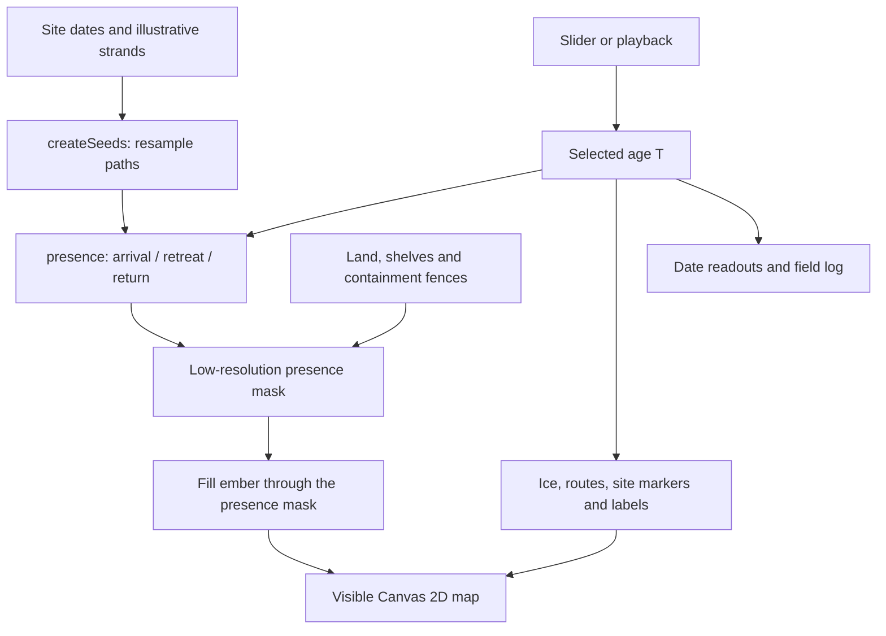

# Architecture

The application is a static document with native JavaScript modules. It has no server-side application, database, framework or runtime package dependencies. GitHub Pages serves the files unchanged.

## Data flow



## Module boundaries

`data/` holds serializable inputs. Site confidence labels and notes belong to the content model, not the renderer. `src/model.js` contains pure functions: given the same inputs, they return the same result without touching the DOM. `src/seeds.js` turns polylines into dated points without mutating the input arrays. `src/atlas.js` owns browser state, offscreen canvases and event listeners.

This boundary lets Node test mathematical behavior without starting a browser. Canvas compositing and interaction still require browser verification.

## Rendering pipeline

1. `buildLand()` prepares two clipped fills for the current sea level: the dry-land mask, and a flat ember wash confined to it. No raster is involved.
2. `buildLand()` constructs a dry-land mask for the selected date, combining modern polygons, schematic islets and exposed shelves.
3. `paintPresence()` draws radial gradients into a mask at 42% of the display canvas's backing dimensions: about 18% of its pixel count before minimum dimensions apply.
4. Fenced seed groups are clipped separately before joining the shared mask. Early African seeds cannot illuminate nearby land across a strait.
5. `drawPresence()` maps alpha through a smoothstep transition from 0.18 to 0.42, with a midpoint of 0.30. This is visual styling, not a probability scale.
6. `rebuildScene()` composes ocean, terrain, presence, ice, arrival accents, routes and markers. `composite()` copies the cached layers to the visible canvas.

Oceans never receive a presence classification. Dashed routes can cross water, but water shading does not encode exploration.

## Time and state

The canonical value `T` is years before present (BP, relative to 1950). Larger numbers are earlier. `pos()` and `timeAt()` translate between dates and slider positions.

Playback advances slider position using elapsed frame time. Each segment receives its intended fraction of playback time. Frames are capped at 120 ms to prevent large jumps after a scheduling delay; background throttling can therefore make playback longer than the nominal 96 seconds.

`dirty` marks the scene for recomposition after a date change, resize, font load or hover change. A requestAnimationFrame callback remains scheduled while paused but does not redraw unless `dirty` is set. There is no separate weather animation.

## Cache invalidation

Seeds without retreat dates are baked into a persistent mask after reaching full presence. Seeds with `gone`/`back` remain dynamic. Fenced groups are recomputed separately.

`bakeTime` records the previous calculation date. If the new date is older (`t > bakeTime`), `resetBake()` clears cached presence. Otherwise backward scrubbing would leave later settlement painted into an earlier scene.

## Projection and resolution

The equirectangular map is cropped to 84°N–56°S:

```text
x = (longitude + 180) / 360 × width
y = (84 - latitude) / 140 × height
```

Display resolution is capped at device-pixel ratio 2. Seed shapes use a bounded cosine adjustment for longitude convergence. This is a visual approximation, not a geodesic area calculation.

## Static delivery

`scripts/build.mjs` copies an allowlist into `dist/`. Relative imports and asset URLs work under the repository subpath used by GitHub Pages. Tests and docs stay in the repository; backups and `.git` do not enter the deployed artifact.

The workflow follows GitHub's [Pages deployment documentation](https://docs.github.com/en/pages/getting-started-with-github-pages/using-custom-workflows-with-github-pages). Only the deployment job receives Pages and identity-token write permissions; checks have read-only repository access.
